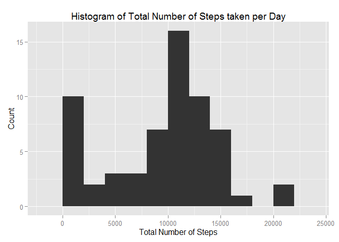
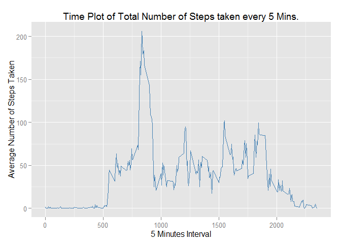
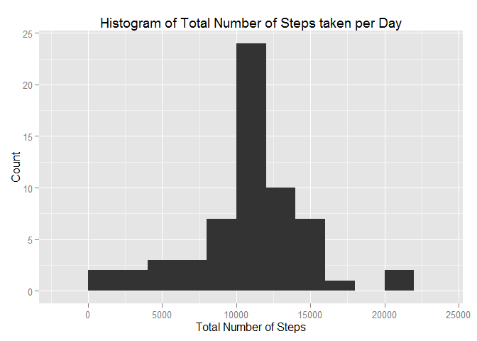
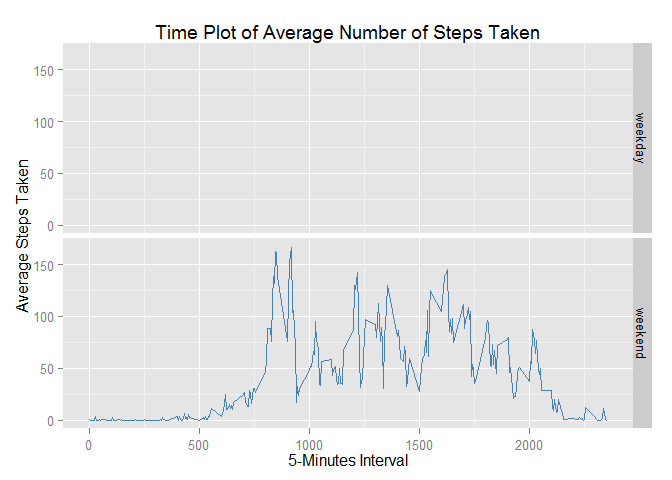

# Reproducible Research: Peer Assessment 1
Alade Yussuf Kofoworola  
Monday, February 9, 2015  


## Loading and preprocessing the data

```r
# Remove all variables on the present workscreen
rm(list=ls())
# setting the working directory
setwd("C:/Users/Yoocuph/Desktop/RepData_PeerAssessment1")
# Unzip to to this directory
    unzip("activity.zip")
# opening connection to the data 
activitycon <- file("C:/Users/Yoocuph/Desktop/RepData_PeerAssessment1/activity.csv",open="r")
# reading the data into the console
activity <- read.csv(activitycon, header = T)
# Closing the Opened COnnection
close(activitycon)
# Converting the date into a POIXct format
Sys.setlocale("LC_TIME","English_United States.1252")
```

```
## [1] "English_United States.1252"
```

```r
activity$date <- as.POSIXct(as.Date(activity$date,format="%Y-%m-%d"))
```


## What is mean total number of steps taken per day?

Plotting the total number of steps taken per day.

```r
# Obtaining the total number of steps taken per day
steps_sum <- tapply(activity$steps, activity$date, sum, na.rm = TRUE)
# Making a histogram of the total number of steps taken per day 
# using the ggplot2 system
library(ggplot2)
plot1 <- qplot(x = steps_sum, geom = "histogram", binwidth = 2000)
plot2 <- plot1 + labs(title = "Histogram of Total Number of Steps taken per Day")
plot3 <- plot2 + labs(x = "Total Number of Steps", y = "Count")
# print the plot
print(plot3)
```

 

Reporting the mean and median total number of steps taken per day

```r
# Computing the mean total steps taken per day 
steps_mean <- tapply(activity$steps, activity$date, mean, na.rm = TRUE)
# Computing the median total steps taken per day 
steps_median <- tapply(activity$steps, activity$date, median, na.rm = TRUE)
steps_mean
```

```
## 2012-10-01 01:00:00 2012-10-02 01:00:00 2012-10-03 01:00:00 
##                 NaN           0.4375000          39.4166667 
## 2012-10-04 01:00:00 2012-10-05 01:00:00 2012-10-06 01:00:00 
##          42.0694444          46.1597222          53.5416667 
## 2012-10-07 01:00:00 2012-10-08 01:00:00 2012-10-09 01:00:00 
##          38.2465278                 NaN          44.4826389 
## 2012-10-10 01:00:00 2012-10-11 01:00:00 2012-10-12 01:00:00 
##          34.3750000          35.7777778          60.3541667 
## 2012-10-13 01:00:00 2012-10-14 01:00:00 2012-10-15 01:00:00 
##          43.1458333          52.4236111          35.2048611 
## 2012-10-16 01:00:00 2012-10-17 01:00:00 2012-10-18 01:00:00 
##          52.3750000          46.7083333          34.9166667 
## 2012-10-19 01:00:00 2012-10-20 01:00:00 2012-10-21 01:00:00 
##          41.0729167          36.0937500          30.6284722 
## 2012-10-22 01:00:00 2012-10-23 01:00:00 2012-10-24 01:00:00 
##          46.7361111          30.9652778          29.0104167 
## 2012-10-25 01:00:00 2012-10-26 01:00:00 2012-10-27 01:00:00 
##           8.6527778          23.5347222          35.1354167 
## 2012-10-28 01:00:00 2012-10-29 01:00:00 2012-10-30 01:00:00 
##          39.7847222          17.4236111          34.0937500 
## 2012-10-31 01:00:00 2012-11-01 01:00:00 2012-11-02 01:00:00 
##          53.5208333                 NaN          36.8055556 
## 2012-11-03 01:00:00 2012-11-04 01:00:00 2012-11-05 01:00:00 
##          36.7048611                 NaN          36.2465278 
## 2012-11-06 01:00:00 2012-11-07 01:00:00 2012-11-08 01:00:00 
##          28.9375000          44.7326389          11.1770833 
## 2012-11-09 01:00:00 2012-11-10 01:00:00 2012-11-11 01:00:00 
##                 NaN                 NaN          43.7777778 
## 2012-11-12 01:00:00 2012-11-13 01:00:00 2012-11-14 01:00:00 
##          37.3784722          25.4722222                 NaN 
## 2012-11-15 01:00:00 2012-11-16 01:00:00 2012-11-17 01:00:00 
##           0.1423611          18.8923611          49.7881944 
## 2012-11-18 01:00:00 2012-11-19 01:00:00 2012-11-20 01:00:00 
##          52.4652778          30.6979167          15.5277778 
## 2012-11-21 01:00:00 2012-11-22 01:00:00 2012-11-23 01:00:00 
##          44.3993056          70.9270833          73.5902778 
## 2012-11-24 01:00:00 2012-11-25 01:00:00 2012-11-26 01:00:00 
##          50.2708333          41.0902778          38.7569444 
## 2012-11-27 01:00:00 2012-11-28 01:00:00 2012-11-29 01:00:00 
##          47.3819444          35.3576389          24.4687500 
## 2012-11-30 01:00:00 
##                 NaN
```

```r
steps_median
```

```
## 2012-10-01 01:00:00 2012-10-02 01:00:00 2012-10-03 01:00:00 
##                  NA                   0                   0 
## 2012-10-04 01:00:00 2012-10-05 01:00:00 2012-10-06 01:00:00 
##                   0                   0                   0 
## 2012-10-07 01:00:00 2012-10-08 01:00:00 2012-10-09 01:00:00 
##                   0                  NA                   0 
## 2012-10-10 01:00:00 2012-10-11 01:00:00 2012-10-12 01:00:00 
##                   0                   0                   0 
## 2012-10-13 01:00:00 2012-10-14 01:00:00 2012-10-15 01:00:00 
##                   0                   0                   0 
## 2012-10-16 01:00:00 2012-10-17 01:00:00 2012-10-18 01:00:00 
##                   0                   0                   0 
## 2012-10-19 01:00:00 2012-10-20 01:00:00 2012-10-21 01:00:00 
##                   0                   0                   0 
## 2012-10-22 01:00:00 2012-10-23 01:00:00 2012-10-24 01:00:00 
##                   0                   0                   0 
## 2012-10-25 01:00:00 2012-10-26 01:00:00 2012-10-27 01:00:00 
##                   0                   0                   0 
## 2012-10-28 01:00:00 2012-10-29 01:00:00 2012-10-30 01:00:00 
##                   0                   0                   0 
## 2012-10-31 01:00:00 2012-11-01 01:00:00 2012-11-02 01:00:00 
##                   0                  NA                   0 
## 2012-11-03 01:00:00 2012-11-04 01:00:00 2012-11-05 01:00:00 
##                   0                  NA                   0 
## 2012-11-06 01:00:00 2012-11-07 01:00:00 2012-11-08 01:00:00 
##                   0                   0                   0 
## 2012-11-09 01:00:00 2012-11-10 01:00:00 2012-11-11 01:00:00 
##                  NA                  NA                   0 
## 2012-11-12 01:00:00 2012-11-13 01:00:00 2012-11-14 01:00:00 
##                   0                   0                  NA 
## 2012-11-15 01:00:00 2012-11-16 01:00:00 2012-11-17 01:00:00 
##                   0                   0                   0 
## 2012-11-18 01:00:00 2012-11-19 01:00:00 2012-11-20 01:00:00 
##                   0                   0                   0 
## 2012-11-21 01:00:00 2012-11-22 01:00:00 2012-11-23 01:00:00 
##                   0                   0                   0 
## 2012-11-24 01:00:00 2012-11-25 01:00:00 2012-11-26 01:00:00 
##                   0                   0                   0 
## 2012-11-27 01:00:00 2012-11-28 01:00:00 2012-11-29 01:00:00 
##                   0                   0                   0 
## 2012-11-30 01:00:00 
##                  NA
```


## What is the average daily activity pattern?

Computing the average number of steps taken every 5 minutes interval over all days considered

```r
# computing average number of steps taken every 5 minutes
stepsinterval_mean <- as.numeric(tapply(activity$steps, activity$interval, mean, na.rm = TRUE))
# creatin the x axis variable (5 minutes interval)
activity$interval <- factor(activity$interval)
steps_interval <- as.numeric(levels(activity$interval))
average_interval <- data.frame(steps_interval, stepsinterval_mean)
# Making the time series plot using ggplot2 
plot4 <- ggplot(data = average_interval, aes(x=as.numeric(steps_interval), y = stepsinterval_mean))
plot4 <- plot4 + geom_line(colour = "steelblue")
plot4 <- plot4 + labs(title = "Time Plot of Total Number of Steps taken every 5 Mins.", x = "5 Minutes Interval", y = "Average Number of Steps Taken")
print(plot4)
```

 
  
Finding the 5 minutes interval with the maximum average number of steps.

```r
interval_mean <- tapply(activity$steps, activity$interval, mean, na.rm = TRUE)
max_mean <- max(interval_mean)
max_find <- max_mean == interval_mean
max_interval <- interval_mean[max_find==TRUE]
names(max_interval)
```

```
## [1] "835"
```


## Imputing missing values

Counting the number of missing values in the data set.

```r
activity$test1 <- complete.cases(activity)
test2 <- table(activity$test1)
test2[c("FALSE")]
```

```
## FALSE 
##  2304
```
  
Obtaining a new dataset by filling in the missing values with the mean of the 5 mins interval across the days

```r
#A loop to check for where missing values and fill them with the mean of the 5 
#mins interval across the days
for(i in 1:length(activity$test))
  {
    if(activity$test[i] == FALSE)
      {
        a <- activity$interval[i]
        dat1 <- activity[(activity$interval == a),]
        activity$steps[i] <- mean(dat1$steps, na.rm = TRUE)
      }
  }
```
  
Plotting the Histogram of the filled Data Set

```r
steps_sum2 <- tapply(activity$steps, activity$date, sum ,na.rm = TRUE)
# Making a histogram of the total number of steps taken per day 
plot11 <- qplot(x = steps_sum2, geom = "histogram", binwidth = 2000)
plot12 <- plot11 + labs(title = "Histogram of Total Number of Steps taken per Day")
plot13 <- plot12 + labs(x = "Total Number of Steps", y = "Count")
# print the plot
print(plot13)
```

 
  
Reporting the mean and median total number of steps taken per day for the new dataset

```r
# Computing the mean total steps taken per day 
steps_mean2 <- tapply(activity$steps, activity$date, mean, na.rm = TRUE)
# Computing the median total steps taken per day 
steps_median2 <- tapply(activity$steps, activity$date, median, na.rm = TRUE)
steps_mean2
```

```
## 2012-10-01 01:00:00 2012-10-02 01:00:00 2012-10-03 01:00:00 
##          37.3825996           0.4375000          39.4166667 
## 2012-10-04 01:00:00 2012-10-05 01:00:00 2012-10-06 01:00:00 
##          42.0694444          46.1597222          53.5416667 
## 2012-10-07 01:00:00 2012-10-08 01:00:00 2012-10-09 01:00:00 
##          38.2465278          37.3825996          44.4826389 
## 2012-10-10 01:00:00 2012-10-11 01:00:00 2012-10-12 01:00:00 
##          34.3750000          35.7777778          60.3541667 
## 2012-10-13 01:00:00 2012-10-14 01:00:00 2012-10-15 01:00:00 
##          43.1458333          52.4236111          35.2048611 
## 2012-10-16 01:00:00 2012-10-17 01:00:00 2012-10-18 01:00:00 
##          52.3750000          46.7083333          34.9166667 
## 2012-10-19 01:00:00 2012-10-20 01:00:00 2012-10-21 01:00:00 
##          41.0729167          36.0937500          30.6284722 
## 2012-10-22 01:00:00 2012-10-23 01:00:00 2012-10-24 01:00:00 
##          46.7361111          30.9652778          29.0104167 
## 2012-10-25 01:00:00 2012-10-26 01:00:00 2012-10-27 01:00:00 
##           8.6527778          23.5347222          35.1354167 
## 2012-10-28 01:00:00 2012-10-29 01:00:00 2012-10-30 01:00:00 
##          39.7847222          17.4236111          34.0937500 
## 2012-10-31 01:00:00 2012-11-01 01:00:00 2012-11-02 01:00:00 
##          53.5208333          37.3825996          36.8055556 
## 2012-11-03 01:00:00 2012-11-04 01:00:00 2012-11-05 01:00:00 
##          36.7048611          37.3825996          36.2465278 
## 2012-11-06 01:00:00 2012-11-07 01:00:00 2012-11-08 01:00:00 
##          28.9375000          44.7326389          11.1770833 
## 2012-11-09 01:00:00 2012-11-10 01:00:00 2012-11-11 01:00:00 
##          37.3825996          37.3825996          43.7777778 
## 2012-11-12 01:00:00 2012-11-13 01:00:00 2012-11-14 01:00:00 
##          37.3784722          25.4722222          37.3825996 
## 2012-11-15 01:00:00 2012-11-16 01:00:00 2012-11-17 01:00:00 
##           0.1423611          18.8923611          49.7881944 
## 2012-11-18 01:00:00 2012-11-19 01:00:00 2012-11-20 01:00:00 
##          52.4652778          30.6979167          15.5277778 
## 2012-11-21 01:00:00 2012-11-22 01:00:00 2012-11-23 01:00:00 
##          44.3993056          70.9270833          73.5902778 
## 2012-11-24 01:00:00 2012-11-25 01:00:00 2012-11-26 01:00:00 
##          50.2708333          41.0902778          38.7569444 
## 2012-11-27 01:00:00 2012-11-28 01:00:00 2012-11-29 01:00:00 
##          47.3819444          35.3576389          24.4687500 
## 2012-11-30 01:00:00 
##          37.3825996
```

```r
steps_median2
```

```
## 2012-10-01 01:00:00 2012-10-02 01:00:00 2012-10-03 01:00:00 
##            34.11321             0.00000             0.00000 
## 2012-10-04 01:00:00 2012-10-05 01:00:00 2012-10-06 01:00:00 
##             0.00000             0.00000             0.00000 
## 2012-10-07 01:00:00 2012-10-08 01:00:00 2012-10-09 01:00:00 
##             0.00000            34.11321             0.00000 
## 2012-10-10 01:00:00 2012-10-11 01:00:00 2012-10-12 01:00:00 
##             0.00000             0.00000             0.00000 
## 2012-10-13 01:00:00 2012-10-14 01:00:00 2012-10-15 01:00:00 
##             0.00000             0.00000             0.00000 
## 2012-10-16 01:00:00 2012-10-17 01:00:00 2012-10-18 01:00:00 
##             0.00000             0.00000             0.00000 
## 2012-10-19 01:00:00 2012-10-20 01:00:00 2012-10-21 01:00:00 
##             0.00000             0.00000             0.00000 
## 2012-10-22 01:00:00 2012-10-23 01:00:00 2012-10-24 01:00:00 
##             0.00000             0.00000             0.00000 
## 2012-10-25 01:00:00 2012-10-26 01:00:00 2012-10-27 01:00:00 
##             0.00000             0.00000             0.00000 
## 2012-10-28 01:00:00 2012-10-29 01:00:00 2012-10-30 01:00:00 
##             0.00000             0.00000             0.00000 
## 2012-10-31 01:00:00 2012-11-01 01:00:00 2012-11-02 01:00:00 
##             0.00000            34.11321             0.00000 
## 2012-11-03 01:00:00 2012-11-04 01:00:00 2012-11-05 01:00:00 
##             0.00000            34.11321             0.00000 
## 2012-11-06 01:00:00 2012-11-07 01:00:00 2012-11-08 01:00:00 
##             0.00000             0.00000             0.00000 
## 2012-11-09 01:00:00 2012-11-10 01:00:00 2012-11-11 01:00:00 
##            34.11321            34.11321             0.00000 
## 2012-11-12 01:00:00 2012-11-13 01:00:00 2012-11-14 01:00:00 
##             0.00000             0.00000            34.11321 
## 2012-11-15 01:00:00 2012-11-16 01:00:00 2012-11-17 01:00:00 
##             0.00000             0.00000             0.00000 
## 2012-11-18 01:00:00 2012-11-19 01:00:00 2012-11-20 01:00:00 
##             0.00000             0.00000             0.00000 
## 2012-11-21 01:00:00 2012-11-22 01:00:00 2012-11-23 01:00:00 
##             0.00000             0.00000             0.00000 
## 2012-11-24 01:00:00 2012-11-25 01:00:00 2012-11-26 01:00:00 
##             0.00000             0.00000             0.00000 
## 2012-11-27 01:00:00 2012-11-28 01:00:00 2012-11-29 01:00:00 
##             0.00000             0.00000             0.00000 
## 2012-11-30 01:00:00 
##            34.11321
```


## Are there differences in activity patterns between weekdays and weekends?

Creating the factor variable day with two levels "weekday" and "weekend"

```r
# Obtaining the days of the week the steps were taken
activity$days <- weekdays(activity$date, abbreviate = TRUE)
# A loop to group each dat to its appropriate week group i.e. weekend or weekdays
for(i in 1:length(activity$days))
  {
    if(activity$days[i] == "Sat" || activity$days[i] == "Sun")
      {
        activity$group[i] <- 2
      }
    else
      {
        activity$group[i] <- 1
      }  
  }
activity$group <- factor(activity$group, levels=c(1,2), labels = c("weekdays","weekend"))
```
Making a Panel time Plot of of the 5-minute interval and the average number of steps taken.

```r
# Dividing the data according the the day group i.e. weekday or weekend
steps_weekend <- activity[(activity$group == "weekend"),]
#
steps_weekday <- activity[(activity$group == "weekday"),]
#
averagesteps_weekend <- as.numeric(tapply(steps_weekend$steps, steps_weekend$interval, mean, na.rm = TRUE))
#
averagesteps_weekday <- as.numeric(tapply(steps_weekday$steps, steps_weekday$interval, mean, na.rm = TRUE))
# Computing the required averages and obtaining the plot data frame. 
average_steps <- as.numeric(cbind(averagesteps_weekday, averagesteps_weekend))
group <- gl(2,288,labels = c("weekday","weekend"))
tsteps <- as.numeric(cbind(steps_interval, steps_interval))
plot_frame <- data.frame(tsteps, average_steps, group)
# Plotting the Data using the ggplot2 system
plot21 <- ggplot(plot_frame, aes(x = tsteps, y = average_steps))
plot21 <- plot21 +geom_line(colour = "steelblue")
plot21 <- plot21 + labs(title="Time Plot of Average Number of Steps Taken", x = "5-Minutes Interval", y = "Average Steps Taken")
plot21 <- plot21 + facet_grid(group~.)
print(plot21)
```

 

```r
#Remove all variables from screen
rm(list=ls())
```
  


## ALADE, Yussuf Kofoworola.

